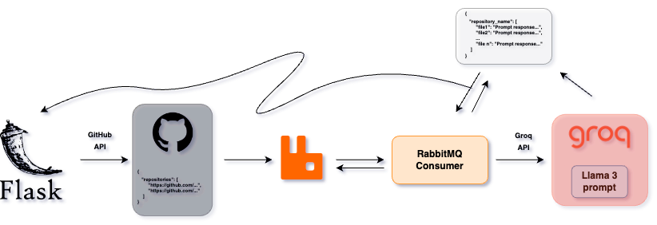

# RepoGenius
<div align="center">
  
</div>

This project, developed as part of the Distributed Systems Engineering course in the Master's Degree Program in Computer Science at the University of Catania, aims to create a distributed system that, starting from a GitHub link or certain parameters, performs an analysis on the reference repository based on elements such as code, language, files, etc.

## 🎯 Project Objectives
1. **Automated Data Collection:** Implement a system that can automatically collect data from GitHub repositories, using direct links or specific parameters, ensuring efficient and accurate extraction of information.
2. **Code Structure Evaluation:** Analyze the code structure within the repositories, examining the organization of files, modularity, and the relationships between different components of the project.
3. **Code Quality Metrics:** Calculate and present code quality metrics such as cyclomatic complexity, test coverage, code smells, and other indicators of good software development practices.
4. **Support for Developers:** Provide tools and detailed reports that help developers better understand their code, identify areas for improvement, and adopt good development practices.

## 🔗 Architecture and Functioning of the RepoGenius Pipeline
<div align="center">
  
</div>
The RepoGenius pipeline is composed of these microservices:

- Flask
- RabbitMQ

## ℹ️ How to use
1. Clone the repository
```bash
git clone https://github.com/ManciSee/RepoGenius.git
cd RepoGenius
```
2. Build and run the docker container
 ```bash
docker compose up --build
```
3. Run the RabbitMQ consumer
```bash
cd rabbitmq/rabbitmq-consumer
python3 consumer.py
```
4. Open the Flask server on port ```5001```
5. Insert a link of a GitHub repository and enjoy!

## 📀 Demo

https://github.com/user-attachments/assets/351ec1e0-e5b9-4ec6-84de-189720c06617

## 👥 Authors
<a href="https://github.com/ManciSee">
  
</a>
<a href="https://github.com/enrysorb">
  
</a>

